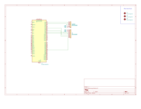

#Snake STM32

:::info
**Author:** ZAPLISHNYI Yehor
**GitHub Project:**	https://github.com/UPB-PMRust-Students/fils-project-2026-yehorzaplishnyi
::: 

##Description

The project uses an STM32F401RE microcontroller as its core component, a TFT screen for display output, and a PS2-style joystick to control the snake. The main objective of the game is to achieve the highest score by eating apples

##Motivation

Playing games from a young age inspired me to create something new in the gaming industry. However, without formal training and experience, that goal felt out of reach. After building several smaller console-based indie games, I decided to use this capstone project to create my own version of the classic game Snake. While the game mechanics are simple, it remains engaging to play and allowed me to work with a variety of Rust crates

##Architecture									
												---------------------
									|-----------|	Display TFT		|
									|			---------------------
	-------------			----------------		-----------------
	|	Laptop	|----------|	Stm F401RE	|-------|	Joystick	|
	-------------			-----------------		-----------------
##Schematics 

##Bill of materials
|	Item				|	Price		|	Usage						|
|-----------------------|---------------|-------------------------------|
|	StmF401RE			|	150	Lei 	|	The Brain of the project	|
|	TFT screen			|	17	Lei		|	Display the program			|
|	joystick			|	8 	Lei		|	Control the program			|
|	cables + breadboard | 	30	Lei		|	Connections between items	|
|	Total				| 	205	Lei		|

##Software

| Crate				|	Description
|-------------------|-----------------------------------------------------------------------------------------------------------------------|					 
|cortex-m			|	Low-level Rust crates for 																							|
|cortex-m-rt		|	low-level ARM Cortex-M hardware access and runtime initialization												|
|defmt				|	An efficient, low-overhead logging framework that																	|
|defmt-rtt			|	transmits binary log messages over RTT`																				|
|embassy-executor	|	The async runtime that drives cooperative multitasking																|
|embassy-stm32		|	The async Hardware Abstraction Layer (HAL) for STM32 microcontrollers												|
|embassy-time		|	Timekeeping library providing asynchronous timers, delays, and uptime metrics										|
|embedded-graphics	|	A 2D graphics primitive library used to draw text, colors, shapes, and rectangles on embedded displays				|
|embedded-hal		|	Standard hardware abstraction traits in Rust																		|
|embedded-hal-bus	|	allowing hardware-agnostic communication over SPI, I2C, and GPIO													|
|fastrand			|	A lightweight pseudo-random number generator compiled without default standard library features for no_std usage	|
|heapless			|	Provides static, fixed-capacity data structures																		|
|panic-probe		|	Panic handler that formats and prints panic messages over defmt when your program crashes							|
|st7735-lcd			|	The display driver for the ST7735 TFT LCD screen over SPI															|
|probe-rs			|	The flashing and debugging host tool																				|

##Log

Week 5
The idea set up and the items are ordered
-------------------------------------------------------------------
week 6 
The items came. Description, Architecture and Schematics was made
-------------------------------------------------------------------
week 7
The code and project was finished

##Links 
https://crates.io/
https://doc.rust-lang.org/
https://www.st.com/resource/en/datasheet/stm32f401re.pdf
https://www.st.com/content/ccc/resource/technical/document/user_manual/98/2e/fa/4b/e0/82/43/b7/DM00105823.pdf/files/DM00105823.pdf/jcr:content/translations/en.DM00105823.pdf
https://www.st.com/resource/en/reference_manual/dm00096844-stm32f401xb-c-and-stm32f401xd-e-advanced-arm-based-32-bit-mcus-stmicroelectronics.pdf

	